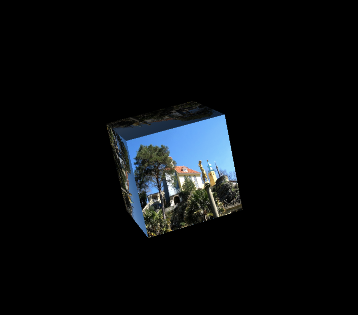

# wizard

- Audio visualizer using JUCE framework and OpenGL Bindings

## Usage

- Clone repo
- Put `Assets/` in `~/wizard`
- Open `wizard.jucer`
- Build and compile (depending on your platform)
- Press `esc` to change input source
